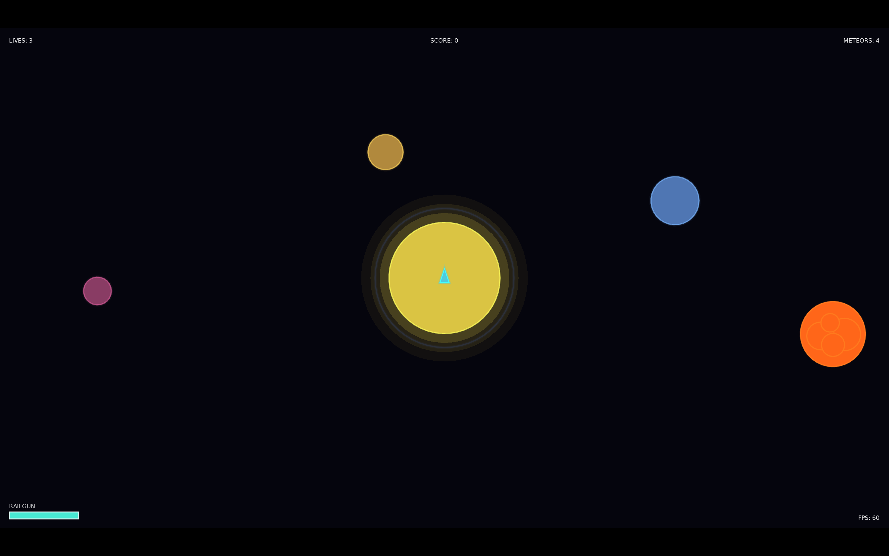
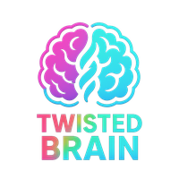

# AxiumForge - SDF Asteroids

A modern, stylized Asteroids-inspired arcade shooter where **all graphics are generated mathematically from SDF/TSDF data** (Signed Distance Fields / Truncated Signed Distance Fields). No bitmap assets—everything is drawn procedurally.




## 🎮 How to Start

1. **Launch the game** with `love .`
2. **Press SPACE** on the main menu to begin
3. **Avoid meteors**, fire the railgun, and protect the inner zone!

### Controls (in-game)
- **←/→ Arrow keys**: Rotate ship
- **↑ Arrow**: Thrust forward
- **SPACE**: Fire railgun
- **P**: Pause
- **ESC**: Quit

### Gameplay Features
- **TSDF Fragmentation**: Meteors break apart realistically on impact
- **Penetrating Railgun**: Shots pass through everything on their path
- **Protected Zone**: Keep meteors out of the inner circle
- **Physics-driven**: Box2D collisions with mass and momentum
- **3 Lives**: Ship respawns after a hit

## 🚀 Getting Started

### Requirements
- [LÖVE 11.5](https://love2d.org/) or newer installed

### Step-by-step

1. **Download/clone the project**
2. **Open a terminal** in the project folder
3. **Run the command:**

**macOS / Linux:**
```bash
love .
```

**Windows:**
Drag the project folder onto `love.exe` or open Command Prompt and run:
```bash
love.exe .
```

4. **Press SPACE** on the main menu to start playing!

### Alternative: Build a .love file

If you want to share the game:
```bash
zip -r AxiumForge.love .
love AxiumForge.love
```

## 🚢 Release & Distribution (v0 baseline)

- Tag a version (`v0.x.y`) and push the tag to trigger the GitHub Actions workflow in `.github/workflows/release.yml`.
- Outputs: `AxiumForge-<version>.love`, Windows fused ZIP (`AxiumForge-windows-<version>.zip`), macOS app ZIP (`AxiumForge-macOS-<version>.zip`), and Linux AppImage (`AxiumForge-linux-<version>.AppImage`).
- Windows: unzip and run `AxiumForge.exe` (allow SmartScreen).
- macOS: unzip, drag `AxiumForge.app` to Applications; first launch may need right-click → Open because the app is unsigned.
- Linux: `chmod +x AxiumForge-linux-<version>.AppImage && ./AxiumForge-linux-<version>.AppImage`; if Fuse2 is missing, install `libfuse2` (e.g., `sudo apt install libfuse2`) or extract with `--appimage-extract` and run `squashfs-root/AppRun`.
- Artifacts are attached automatically to the GitHub release created from the tag.
- Web build is optional and manual (see `docs/RELEASE.md` for love.js guidance).

## 🎨 Visual Style

**“Glow Vector Look”** combined with mathematical SDF rendering:
- All objects drawn from distance-field primitives
- Multi-layer glow effects
- Animated solar-system background with orbiting planets
- No PNG/JPG assets—100% procedural graphics

## 🔧 Technical Overview

### Architecture
```
src/
  core/         - Core systems (physics, input, game state)
  entities/     - Game entities (ship, meteor, railgun)
  render/       - Rendering systems (SDF, background, UI)
  data/         - Data definitions (meteor types, settings)
```

### Key Technologies
- **LÖVE 2D (Lua)**: Game engine and framework
- **Box2D**: 2D physics engine (collision, ricochet, momentum)
- **SDF/TSDF**: Mathematical shape representation
- **Data-driven design**: All parameters in external files

### SDF System

Meteors are defined as composite shapes:
```lua
{
  id = "large_01",
  baseRadius = 70,
  primitives = {
    { shape = "circle", r = 70, offset = {x=0, y=0} },
    { shape = "circle", r = 35, offset = {x=20, y=-15} },
    -- ... more primitives
  },
  density = 2.0,
  fracture_threshold = 150
}
```

### TSDF Fragmentation

When a meteor is hit:
1. Accumulated damage is checked against the threshold
2. If exceeded: spawn 2–3 fragments
3. Fragments scale SDF data (0.5x–0.7x)
4. Fragments inherit physical properties (mass, velocity)
5. Minimum size stops further fragmentation

## 📊 Status

### ✅ MVP Complete (Phase 1)
- [x] Project structure and LÖVE setup
- [x] Core systems (Physics, Input, Game State)
- [x] Data layer (Settings, SDF meteor definitions)
- [x] SDF rendering with glow
- [x] Ship entity with Box2D physics
- [x] Meteor entity with SDF composites
- [x] Meteor spawning system
- [x] Railgun with penetrating raycast
- [x] TSDF fragmentation
- [x] Railgun visual effects
- [x] Protected zone collision detection
- [x] Ship–meteor collision detection
- [x] Game over conditions
- [x] Animated background with solar system
- [x] UI system (score, lives, cooldown, FPS)

### 🔜 Next Features (Phase 2)
See [TODO](TODO) for the detailed plan:
- **Visual Enhancement**: 3D-like shading, normals, terminators
- **Gameplay Polish**: Screen shake, sound, difficulty scaling
- **Advanced Features**: Shaders, LÖVR port, lore system

## 📁 Project Files

- `main.lua` - Main game loop
- `conf.lua` - LÖVE configuration
- `TODO` - Detailed development plan
- `CHANGELOG` - Implementation overview
- `CLAUDE.md` - AI assistance guidelines
- `docs/PROJECT/project.md` - Full project specification

## 🎯 Design Philosophy

1. **Data-driven**: No hardcoded values in logic
2. **Modular**: Clear separation of responsibilities
3. **SDF-based**: All graphics from mathematical primitives
4. **Physics-heavy**: Box2D drives movement and collision
5. **MVP first**: Playable iteration before advanced features

## 🐛 Known Issues / Limitations

- No invulnerability frames on respawn
- Screen shake not implemented yet
- Background perspective is top-down (target is 20–30 degrees)
- No 3D-like shading yet (only glow)
- No audio

## 📖 Further Reading

- [LÖVE Documentation](https://love2d.org/wiki/Main_Page)
- [Box2D Manual](https://box2d.org/documentation/)
- [Signed Distance Fields](https://iquilezles.org/articles/distfunctions2d/)

## 📝 License

Released under the MIT License. See `LICENSE` for details.

## 🤖 Development

This project is built with assistance from Claude Code (Anthropic).

---

**Enjoy the game! Destroy some meteors! 🚀💥**

## ⚠️ Disclaimer

Use this software at your own risk. The contributors and copyright holders provide it without warranties or guarantees of any kind.

Kindly \
**Twisted Brain** \
Claude 4.5 Sonet and \
GPT 5.1


